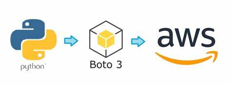

Aqui está um exemplo de `README.md` para o seu projeto de monitoramento de instâncias EC2 na AWS:

```markdown
# Monitoramento de Instâncias EC2 na AWS

Este projeto tem como objetivo monitorar o custo de instâncias EC2 na AWS e desligar automaticamente as instâncias que ultrapassarem um limite de custo predefinido.

## Descrição

O script Python utiliza a biblioteca `boto3` para interagir com a AWS e verificar o custo das instâncias EC2. Caso o custo de uma instância ultrapasse o limite predefinido, o script irá parar a instância para evitar custos excessivos.

### Funcionalidades

- Verificação periódica de instâncias EC2 em execução.
- Cálculo e monitoramento de custos fictícios das instâncias.
- Desligamento automático das instâncias que ultrapassarem o limite de custo.
- Logs detalhados para monitoramento do processo.

## Pré-requisitos

Antes de executar o projeto, é necessário configurar as credenciais da AWS e a região no arquivo `.env`.

### Dependências

- Python 3.x
- `boto3`: Biblioteca para interagir com os serviços AWS.
- `python-dotenv`: Biblioteca para carregar variáveis de ambiente a partir de um arquivo `.env`.

## Instalação

1. Clone este repositório:

   ```bash
   git clone https://github.com/seu-usuario/avaliacao-custo-aws
   cd avaliacao-custo-aws/python
   ```

2. Crie um ambiente virtual (opcional, mas recomendado):

   ```bash
   python -m venv venv
   source venv/bin/activate  # No Windows: venv\Scripts\activate
   ```

3. Instale as dependências:

   ```bash
   pip install -r requirements.txt
   ```

4. Configure o arquivo `.env` com suas credenciais da AWS:

   ```env
   AWS_REGION=us-east-1
   AWS_ACCESS_KEY_ID=suas-chaves-de-acesso
   AWS_SECRET_ACCESS_KEY=sua-chave-secreta
   ```

5. Execute o script Python localmente:

   ```bash
   python ec2_monitor.py
   ```

### Como rodar com Docker

Este projeto também pode ser executado em um container Docker.

1. Construa a imagem Docker:

   ```bash
   docker build -t ec2-monitor .
   ```

2. Execute o container:

   ```bash
   docker run --env-file .env ec2-monitor
   ```

## Arquitetura do Projeto

- **ec2_monitor.py**: O script principal que interage com a AWS para monitorar as instâncias EC2 e interrompê-las caso ultrapassem o limite de custo.
- **Dockerfile**: Arquivo para construir a imagem Docker que contém o ambiente necessário para rodar o script Python.
- **.env**: Arquivo de configuração para armazenar as credenciais da AWS e a região.

## Logs

O script gera logs detalhados sobre o status das instâncias EC2 e ações executadas, como desligamento de instâncias, no console.

## Limitações

- O cálculo de custo das instâncias é fictício e precisa ser adaptado para refletir valores reais de custo da AWS.
- A automação de desligamento é baseada apenas no limite de custo predefinido. Não há verificações de estado de execução das instâncias além do custo.

## Contribuições

Sinta-se à vontade para enviar contribuições! Para isso, faça um fork do projeto e envie pull requests com suas melhorias ou correções.

## Licença

Este projeto está licenciado sob a MIT License - veja o arquivo [LICENSE](LICENSE) para mais detalhes.

---

Desenvolvido por [Rayan Freitas](mailto:rayan_freitas@fitbank.com.br).
```

Esse `README.md` cobre a descrição do projeto, dependências, instalação, execução, e informações gerais sobre o funcionamento. Certifique-se de atualizar o link de repositório e outros detalhes conforme necessário.
